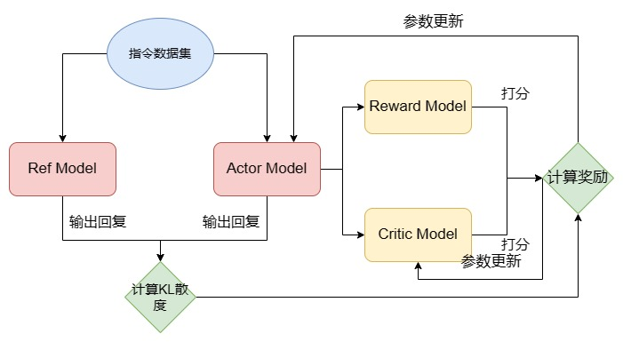

## Encoder Only - Beyond BERT
- *RoBERTa*:
  - Get rid of NSP pretraining task, and the MLM task is now dynamically done in training stage (rather than pre-processing).
  - More data and larger batch and training steps and fixed 512 sequence length.
  - Larger BPE vocab.
- *ALBERT*: how to decrease the model size and maintain performance
  - Decompose the Embedding: from $V \times H$ to $V \times E \rightarrow E \times H$ by adding a linear layer, so the embedding layer will has a smaller param size.
  - The 24 layers of encoder is shared (However the speed is the same).
  - *SPO* pretraining task: not randomly add a next sequence as negitive sample, but inverse the order of true sample as the negitive sample, so the order needs to be learned.

## Encoder-Decoder
- *T5*:
  - Use RMSNorm as LayerNorm:
    $$ \text{RMSNorm}(x) = \frac{x}{\sqrt{\frac{1}{n}\sum_{i=1}^nw_i^2+\epsilon}}$$
  - Pretraining task: MLM, and a lot of other tasks.

## Decoder Only
- *GPT*: actually the first to introduce pretrain, fine-tune.
  - Hidden states will go through 3 matrices to get query, key, value, then do a casual masked softmax. 
  - Pre-norm, layer normalization before attention, because as the model size grow, the training is more unstable.
  - *CLM* (casual language model): predict next token based on all tokens before (advanced n-gram, n-gram uses n tokens before).
  - GPT2: zero-shot as target.
  - GPT3: larger!!! And use a *sparse attention*. Few-shot.
  - ChatGPT: pretraining -> prompt fine-tune -> RLHF
- *LLaMA*:
  - LLaMA-1 (2023.2), LLaMA-2 (2023.7) introduce *Grouped-Query Attention*, LLaMA-3 (2024.4).
- *GLM*: 
  - Post Norm, one linear layer as output layer, GeLUS.
  - Combine MLM and CLM, masks a sequence of tokens (not one token like MLM), and use next token prediction to generate masked ones.
  - GLM later give up MLM, just use CLM, and larger!!!

## Tokenizer
- *WordPiece*: start from characters (same as BPE), but when merging, maximize the likelihood of the language model rather than based only on frequncy. unhappiness -> [un, ##happi, #ness], # denotes part of a word.
- *SentencePiece*: deal all languages with or without blank space. Input is unicode or byte, then we have two method go forward: BPE or Unigram LM (EM alg).

## Word Embedding
- Mathods
  - one-hot: not good
  - Static Word Embedding: Word2Vec (CBOW / Skip-gram, catch sementic), Glove (gloval freq), FastText (n-gram based, can handle OOV, out-of-vocabulary). Word as the input embedding layer for LM.
  - Contextual Word Embedding: ELMo (bi-LSTM), GPT (Transformer), BERT (bi-Transformer + WordPiece), T5/XLNet. It is the output layer not the input embedding layer.

## LLM
- Higher Sequence Length Support
  - *Rotary Positinal Encoding* (RoPE)
- Pretrain: 
  - *Deepspeed*, use *ZeRO* (Zero Redundancy Optimizer) and CPU-offload.
  - ZeRO:
    - Divide memory into Model States (model, gradient, adam states...) and Residual States (activation, cache...).
    - ZeRO-1, split Adam, every card stores $\frac 1 N$ Adam state.
    - ZeRO-2, plus split gradient, every card stores $\frac 1 N$ Adam state and gradient
    - ZeRO-3, plus split model, every card stores $\frac 1 N$ Adam state, gradient and model.
    - The higher the number, the less memory per card, but more communication burden.
  - Data: combines different source.
    - Quality is important then data size.
    - Get data -> filter bad data -> get rid of repeated data.
- *Supervisor Finetune* (SFT):
  - **Instruction Follow** is the task, the data quality is again important.
  - SFT is still CLM, instruction and response will all be generated, but the instruction prediction will not be part of the loss. Only response will form the loss.
  - For multiple round conversation, this ability is entirely trained in SFT, given input <prompt_1><completion_1><prompt_2><completion_2><prompt_3><completion_3>, and output is [MASK]<completion_1>[MASK]<completion_2>[MASK]<completion_3>.
- *RLHF* (Reinforcement Learning from Human Feedback):
  - Now we know a lot of knowledge and how to follow an instruction, we need practice.
  - *Reward Model* (seperated model, just for outputing value): very like a text classification task, we add a output layer which outputs a scalar reword. But during training, we use (prompt, response A), (prompt, response B) output r_A, r_B, then optimize the pairwise loss. This RM can be a smaller one after SFT, or train from scratch, which way is better is unknown.
  - *Proximal Policy Optimization*, stable, low-cost RL algorithm, use the RM to do the RLHF.
  - <figure style="text-align: center;">
      
      <figcaption> RLHF </figcaption>
    </figure>
  - The Algorithm:
    - Two LLM, both after SFT, Ref Model with frozen parameters, Actor Model will be trained. Two RM, both initialized from above RM, Reward Model with frozen parameters and Critic Model trained.
    - Given a prompt, Actor Model and Ref Model will response. And compute the KL diverge: 
      $$ r_{KL} = -\theta_{KL}D_{KL}(\pi_{PPO}(y \mid x) \| \pi(base)(y \mid x))$$
      where the first $\pi$ is output of Actor Model, second is Ref Model.
    - Actor Response scored by two RM, Critic Model score is accumulate reward (from position $i$). Reward is:
      $$ \textit{loss} = - \left ( kl_{ctl} r_{KL} + \gamma V_{t+1} - V_t \right) \log P(A_t \mid V_t) $$
      where $kl_{ctl}$ is weight of KL diverge, $\gamma$ is weight of next time score, $V_t$ is score of Critic Model, $A_t$ is score of Reward Model.
    - Compute actor loss and critic loss, update Actor Model and Critic Model.
  - Why we need 4 model? Ref Model and Reward Model is for the training not too far from the pretrained and SFT model then lose ability. In this way, we need a lot of GPU memory. So someone introduce *Direct Preference Optimization*, turn the RL to supervised learning, direct learn the preference (the reward to policy projection is used).

## Build a LLM
- *kv_head*: original Transformer use Q, K, V all multi heads, but in large LLM, this maybe not efficient. So *Multi-Query Attention* use 1 head only for K, V and they are repeated to match Q heads. *Grouped-Query Attention* K, V heads maybe not 1, maybe 8 or something, and Q with larger heads, it is a balance between MQA and origin Transformer.
- *RoPE*: let use $R$ for this operation, $q_p, k_p$ are query vector and key vector at position $p$, then attention score is:
  $$ \text{score}(q_p, k_p) = \langle R(q_p, p), R(k_p, p) \rangle $$
  And $R$ has property:
  $$ \langle R(q, p), R(k, p^{'}) \rangle = \langle R(q, 0), R(k, p^{'} - p) \rangle $$
  The math: given $x = [(x_1, x_2), \ldots, (x_{d-1}, x_d)]$, each pair is rotated by an angle $\theta_i \cdot p$, $p$ is the position. Let $z_i = x_{2i} + ix_{2i+1}$, $R(z_i,p) = z_i \cdot e^{i\theta_i p}$. The matrix form is:
  $$
  \begin{bmatrix}
  x_{2i}^{'} \\
  x_{2i + 1}^{'}
  \end{bmatrix}
  =
  \begin{bmatrix}
  \cos(\theta_i p) & -\sin(\theta_i p) \\
  \sin(\theta_i p) & -\cos(\theta_i p)
  \end{bmatrix}
  \begin{bmatrix}
  x_{2i} \\
  x_{2i + 1}
  \end{bmatrix}
  $$
  RoPE can extrapolate to unseen longer sequences.

## References
1. [happy-llm](https://datawhalechina.github.io/happy-llm)